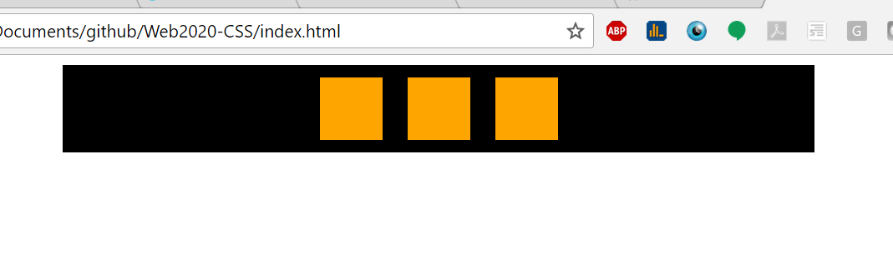
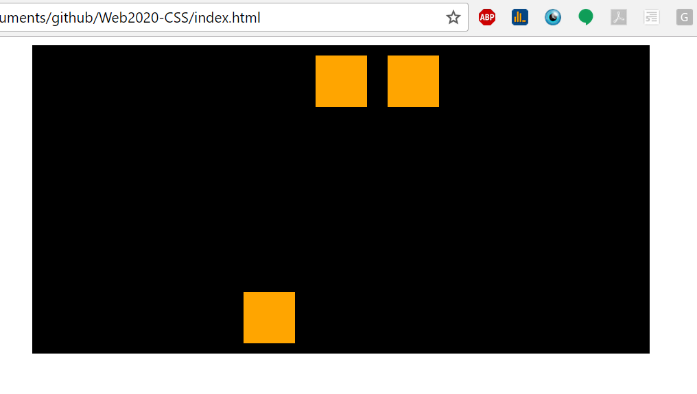
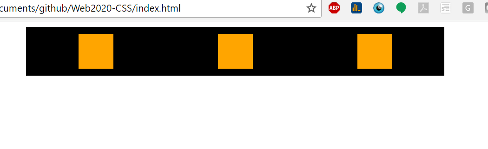

#Web2020 Exam 1

For questions 1 through 8, start with the following html and css:

```html
  <div class="cont">
    <div class="box"></div>
    <div class="box"></div>
    <div class="box"></div>
  </div>
```

```css
.cont{
  background-color: black;
  width: 600px;
  margin: 0 auto;
}
.box{
  width: 50px;
  height: 50px;
  background-color: orange;
}
```

###Question 1
Describe the simplest CSS changes required to create the following layout **using flexbox properties**:


<!-- 
.cont{
  background-color: black;
  width: 600px;
  margin: 0 auto;
  display: flex;
  justify-content: space-between;
}
.box{
  width: 50px;
  height: 50px;
  background-color: orange;
} -->


###Question 2
Describe the simplest CSS changes required to create the following layout **using flexbox properties**:


 <!-- .cont{
  background-color: black;
  width: 600px;
  margin: 0 auto;
  display:flex;
  flex-direction: column;  
}
.box{
  width: 50px;
  height: 50px;
  background-color: orange;
  margin-bottom: 10px;
  
}  -->


###Question 3
Describe the simplest CSS changes required to create the following layout **using flexbox properties**:


<!-- .cont{
  background-color: black;
  width: 600px;
  margin: 0 auto;
  display:flex;
  flex-direction: column;
  align-items: center;
 
}
.box{
  width: 50px;
  height: 50px;
  background-color: orange;
  margin-bottom: 10px;
  

} -->

###Question 4
Describe the simplest CSS changes required to create the following layout **using flexbox properties**:


<!-- 
.cont{
    background-color: black;
    width: 600px;
    margin: 0 auto;
    display:flex;
    flex-direction: row;
    justify-content: center;
   
}
  .box{
    width: 50px;
    height: 50px;
    background-color: orange;
    margin: 10px;
    

  }

 

///

<!--  -->
###Question 5
(Hint, give the container a height of 300px)
Describe the simplest CSS changes required to create the following layout **using flexbox properties**:



<!-- 
.cont{
  background-color: black;
  width: 600px;
  height: 300px;
  margin: 0 auto;
  display: flex;
  flex-direction: row;
  justify-content: center;
}
.box{
  width: 50px;
  height: 50px;
  background-color: orange;
  margin: 10px;
}

#one {
  display: flex;
  align-self: flex-end;
} -->

###Question 6
(Hint, give the container a height of 300px)
Describe the simplest CSS changes required to create the following layout **using flexbox properties**:


<!-- .cont{
  background-color: black;
  width: 600px;
  height: 300px;
  margin: 0 auto;
  display: flex;
  flex-direction: row;
  justify-content: space-around;

}
.box{
  width: 50px;
  height: 50px;
  background-color: orange;
  margin: 10px;
}

#one {
  display: flex;
  align-self: flex-end;
} -->


###Question 7
Describe the simplest CSS changes required to create the following layout **using flexbox properties**:



<!-- .cont{
  background-color: black;
  width: 600px;
  margin: 0 auto;
  display: flex;
  justify-content: space-around;
  
}
.box{
  width: 50px;
  height: 50px;
  background-color: orange;
  margin: 10px;
} -->


###Question 8
(Hint: requires the flex-grow or flex shorthand property)
Describe the simplest CSS changes required to create the following layout **using flexbox properties**:


<!-- 

.cont{
  background-color: black;
  width: 600px;
  margin: 0 auto;
  display: flex;
 
  
}
.box{
  width: 50px;
  height: 50px;
  background-color: orange;
  margin: 10px;
  flex-basis: 30%;
}
 -->
